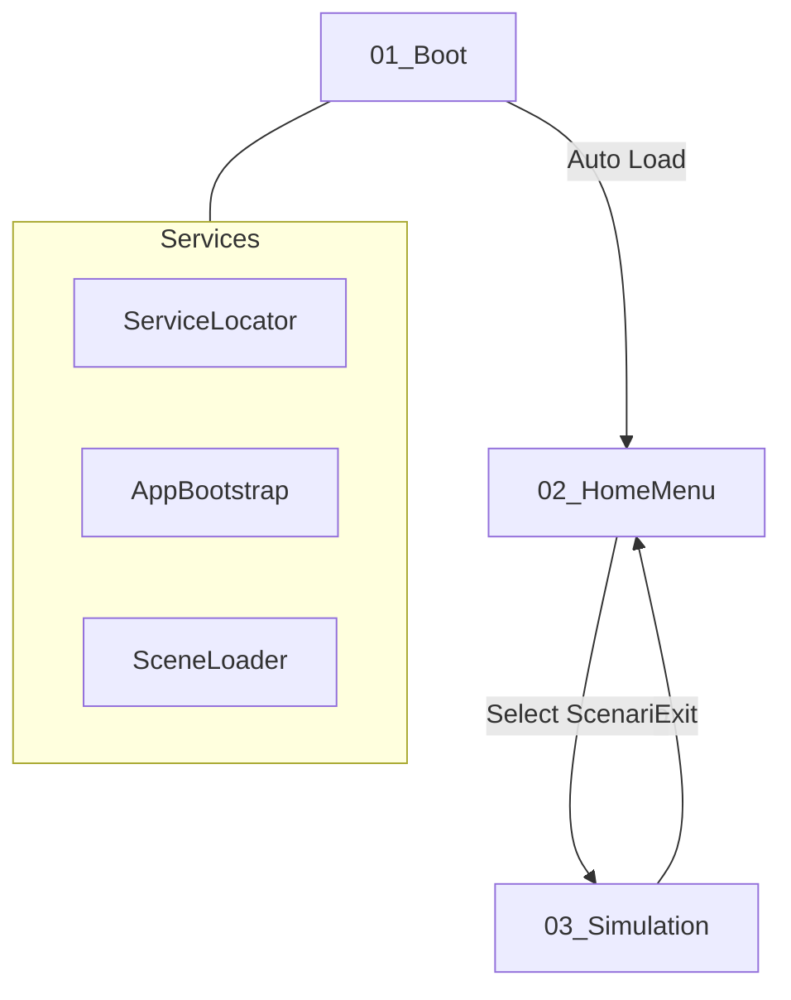

# 🏗️ AR Training App | Full Set Architecture Guide

This guide provides a "Canvas-style" architecture overview for the Reactor AR project. Use this to ensure all scenes, prefabs, and scripts are correctly interconnected.

---

## 1. Scene Lifecycle & Flow
The application follows a structured lifecycle to ensure services are localized and memory is managed efficiently.

### Scene Breakdown
| Scene | Purpose | Core GameObjects |
| :--- | :--- | :--- |
| **01_Boot** | App Initialization | `[SYSTEM]`, `BootCanvas` |
| **02_HomeMenu** | Scenario Selection | `HomeMenuCanvas`, `ScenarioManager` |
| **03_Simulation** | The AR Experience | `XR Origin (AR Rig)`, `[TRAINING_CONTROLLER]`, `SimulationCanvas` |

---

## 2. GameObject & Script Matrix
Every scene requires specific GameObjects with specific scripts attached. Follow this matrix for perfect setup.

### [01_Boot]
| GameObject | Script(s) | Function |
| :--- | :--- | :--- |
| `[SYSTEM]` | `AppBootstrap.cs`, `ServiceLocator.cs` | Initializes singleton services. |
| `[SCENE_MANAGER]` | `SceneLoader.cs` | Handles async loading and fade transitions. |
| `BootCanvas/Overlay` | `BootScreen.cs` | Displays the splash screen and logo. |

### [03_Simulation]
| GameObject | Script(s) | Function |
| :--- | :--- | :--- |
| `XR Origin (AR Rig)` | `ARSessionManager.cs`, `PlaneDetectionManager.cs` | Controls the AR camera and world tracking. |
| `[AR_HANDLERS]` | `ARRaycastHandler.cs`, `AnchorManager.cs` | Handles floor detection and placement logic. |
| `[TRAINING_CONTROLLER]`| `StepController.cs`, `ModelSwapManager.cs` | Manages the training logic and 3D swaps. |
| `[SIM_DATA]` | `TelemetrySimulator.cs`, `ProgressTracker.cs` | Generates fake reactor data and tracks score. |

---

## 3. Prefab Anatomy
Prefabs are the building blocks of this app. Ensure these internal structures are maintained.

### 🖼️ UI Prefabs
- **GlassPlinth.prefab**:
    - *Child: Mesh*: The semi-transparent glass base.
    - *Child: InteractionZone*: Script: `ScanningHUD.cs`.
- **TelemetryBadge.prefab**:
    - *Component*: `StatusBadgeCtrl.cs`.
    - *TextMeshPro*: For displaying the dynamic values (RPM, Temp).

### 🧊 Model Prefabs (The Reactor Steps)
- **Step1_PowerBox**: Initial visual state (Closed).
- **Step2_IBCTank**: Added components for intermediate step.
- **Step3_ReactorFull**: The completed assembly.
- *Requirement*: Every model prefab **must** have a root pivot at `(0,0,0)` to ensure they align perfectly when swapped by `ModelSwapManager`.

---

## 4. Scriptable Object Vocabulary (Standardization)
To keep the UI looking professional (e.g., in `TrainingScenario.asset`), use these standardized terms for your string fields.

### 📊 Telemetry Units (`TelemetryRange.label`)
Always use uppercase for units to match industrial HUD aesthetics:
- **`RPM`**: Revolutions Per Minute (Stirrer).
- **`BAR`**: Pressure units (Main Tank).
- **`°C`**: Temperature units (Jacket).
- **`PSI`**: Secondary pressure (Gas lines).
- **`L/min`**: Flow rate (Coolant).

### 🏷️ Status Badges (`TrainingStep.statusBadge`)
Short, high-impact words used in the badge UI:
- **`STANDBY`**: Reactor powered but idle.
- **`ACTIVE`**: Operation in progress.
- **`DANGER`**: Value out of bounds.
- **`STABLE`**: Within target range.
- **`SYNCING`**: Initializing AR data.

### 📝 Step Labels (`TrainingStep.stepLabel`)
Instructional and action-oriented:
- **`INITIATE POWER`**: Turning on the system.
- **`CALIBRATE STIRRER`**: Adjusting the RPM.
- **`SEAL MAIN TANK`**: Finalizing assembly.
- **`MONITOR COOLANT`**: Observation phase.

---

> [!TIP]
> **Pro Tip**: Use the `TelemetrySimulator` script's "Drift" settings in the Inspector to make the values fluctuate slightly. This makes the AR experience feel more alive.
