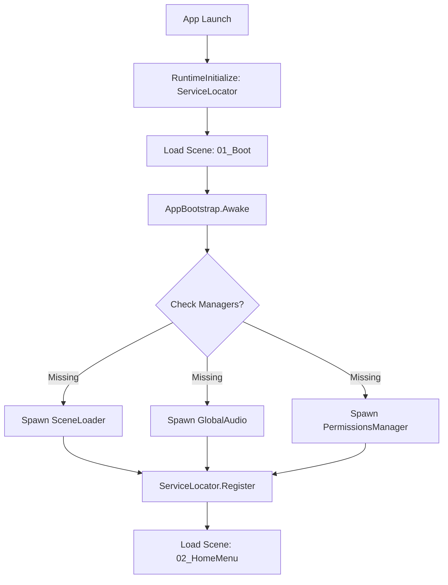

# Technical Guide: Persistent GameObjects & Global Architecture

This document outlines the architecture for persistent systems in the **AR Training App**. Global managers ensure that core services like Scene Transitions, Event Handling, and Audio remain active and consistent across scene reloads.

## Global Persistence Summary

| Name | Purpose | Required Scripts | Key Components | Initialization | Persistence |
| :--- | :--- | :--- | :--- | :--- | :--- |
| **[AppBootstrap]** | App entry point & global settings. | `AppBootstrap.cs` | Transform | `01_Boot` (Awake) | `DontDestroyOnLoad` |
| **[ServiceLocator]** | Static registry for finding global managers. | `ServiceLocator.cs` | N/A (Static) | `RuntimeInitialize` | Static Instance |
| **[SceneLoader]** | Handles async transitions & loading screens. | `SceneLoader.cs` | Transform, Canvas, Image | Created by Bootstrap | `DontDestroyOnLoad` |
| **[EventBus]** | Global pub/sub for decoupled communication. | `EventBus.cs` | N/A (Static) | `RuntimeInitialize` | Static Instance |
| **[GlobalAudio]** | Global BGM and UI sound effects. | `AudioController.cs` | AudioSource (x2) | Created by Bootstrap | `DontDestroyOnLoad` |
| **[Permissions]** | Manages OS-level camera/storage access. | `CameraPermission.cs` | Transform | Created by Bootstrap | `DontDestroyOnLoad` |

---

## Scene Persistence Matrix

How global systems interact with specific scenes:

| Scene Name | Role | Persistent Systems Activity |
| :--- | :--- | :--- |
| **01_Boot** | **Entry Point** | Initializing all systems; displaying splash screen/loading. |
| **02_HomeMenu** | **Main Hub** | Background music playing; UI event tracking active. |
| **03_Simulation**| **AR Training** | AR tracking active; Permissions verified; EventBus tracking training steps. |

---

## Initialization Flow



---

## Detailed Components Overview

### 1. [AppBootstrap]
The central entry point of the application logic.
- **Purpose**: Configures global environment variables (Target Frame Rate, Screen Timeout) and ensures all mandatory managers are instantiated.
- **Initialization Notes**: 
    - Setup: Placed in the **01_Boot** scene. It verifies if `SceneLoader` is present; if not, it instantiates it.
- **Persistence Method**: `DontDestroyOnLoad(gameObject)`.

### 2. [ServiceLocator]
A centralized registry for finding managers without tight coupling.
- **Purpose**: Provides a `Get<T>()` method, replacing slow `FindObjectOfType` calls.
- **Persistence Method**: Static class instance.

### 3. [SceneLoader]
Manages the visual and logical transition between scenes.
- **Purpose**: Loads scenes asynchronously and displays a "Loading" overlay.
- **Key Components**: `Canvas`, `CanvasGroup`, `Image` (Loading screen).
- **Persistence Method**: `DontDestroyOnLoad`.

### 4. [GlobalAudio]
Ensures background music and UI sounds are never interrupted.
- **Key Components**: `AudioSource` (Music), `AudioSource` (SFX).
- **Persistence Method**: `DontDestroyOnLoad`.

---

## Best Practices for Persistent Systems

### Avoiding Duplicate Objects on Scene Reload
Use a **Singleton Guard** pattern. If an instance already exists, the new one destroys itself.

```csharp
private void Awake()
{
    if (Instance != null && Instance != this)
    {
        Destroy(gameObject);
        return;
    }
    Instance = this;
    DontDestroyOnLoad(gameObject);
}
```

### Cold-Starting from Any Scene (Editor)
During development, you often want to start Play mode from `03_Simulation` without going through `01_Boot`.
- **Implementation**: In `AppBootstrap.Awake()`, check for missing mandatory managers (like `SceneLoader`).
- **Benefit**: Allows for faster iteration without breaking global dependencies.

### Recommended Prefab Setup
- **[GLOBAL_SYSTEMS] Prefab**: A single prefab containing all persistent managers.
- **Placement**: Place this prefab in `01_Boot`. 
- **Structure**:
    - `[GLOBAL_SYSTEMS]` (Parent)
        - `AppBootstrap`
        - `SceneLoader` (Canvas-based)
        - `GlobalAudio`
        - `PermissionsManager`
